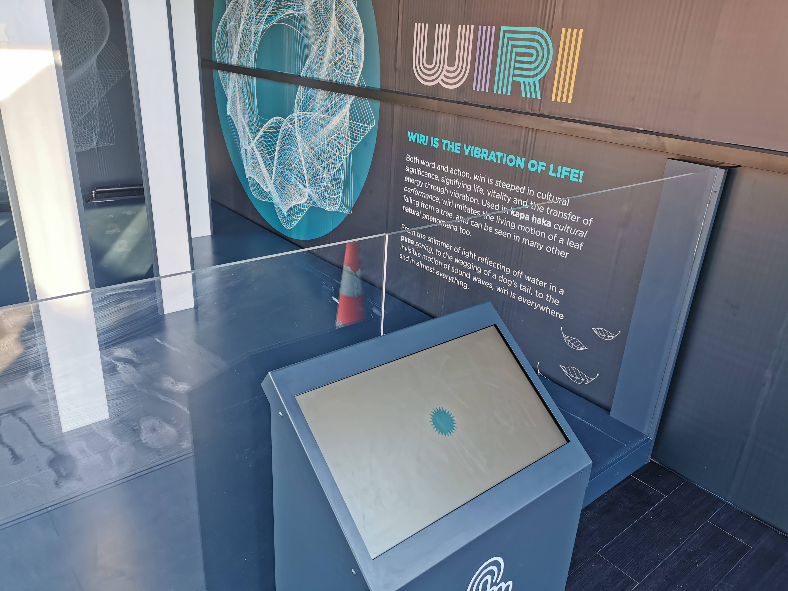

# About WIRI

### Description

*Wiri* is an interactive sound and light installation created by the Museum of Transport and Technology in Auckland New Zealand.

Wiri is about how both sound and light are forms of vibration where there four distinctive primitive waveforms that define how the shape of a waveform can have unique characteristics. The term Wiri is steeped in significance in Maori culture and signifies the vibration of Life.

### OpenFrameWorks Application

This application is built using the C++ library called [OpenFrameworks](https://openframeworks.cc/) - This application is using version *0.11.2* currently. 

#### Instructions for building the app

* Using the OpenFrameworks make system you can run *make* in the terminal or command line to compile and build and executible on your chosen operating system.
* Once the application has been built run *make run*  or *cd /bin* and *./wiri* to run the application.

#### Dependencies
* [ofxSerial](https://github.com/bakercp/ofxSerial)

### Arduino Application

The Arduino app is built for using the Arduino compatible microcontroller [Teensy 4.0](https://www.pjrc.com/store/teensy40.html). Additionally Wiri uses the Teensy 4.0 compatible [audio board](https://www.pjrc.com/store/teensy3_audio.html) to generate and modulate waveforms. Wiri also uses individually addressable led strips - *WS2812B* strips that are controlled using the [Fastled LED library](http://fastled.io/) and the [WS812B Teesny Serial Library](https://www.pjrc.com/non-blocking-ws2812-led-library/) together. 

#### Dependencies
* [FastLed](https://github.com/FastLED/FastLED)
* [WS2812Serial](https://github.com/PaulStoffregen/WS2812Serial)

